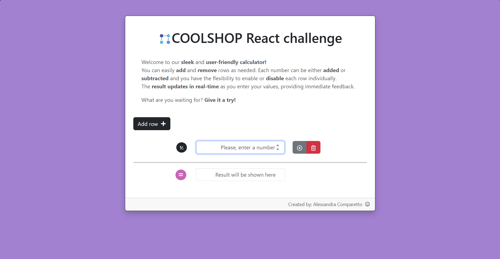

# COOLSHOP React challenge
This project was bootstrapped with [Create React App](https://github.com/facebook/create-react-app).

In the project directory, you can run:
### `npm start`

Runs the app in the development mode.\
Open [http://localhost:3000](http://localhost:3000) to view it in your browser.

## Description
Welcome to our sleek and user-friendly calculator!
You can easily add and remove rows as needed. Each number can be either added or subtracted and you have the flexibility to enable or disable each row individually.
The result updates in real-time as you enter your values, providing immediate feedback.

What are you waiting for? Give it a try!

Particulare care was put into UX and UI. When a new row is created, the input field is activated and it's ready to be filled in. 
Moreover, labels and placeholders where used to conform to the standards of web accessibility as recommended by Lighthouse.

